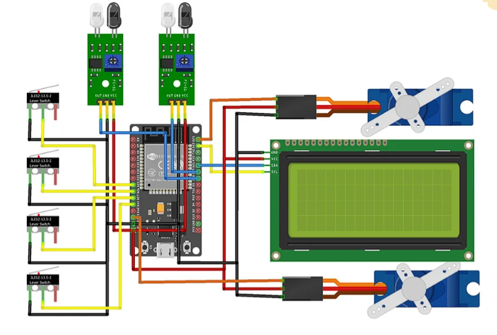
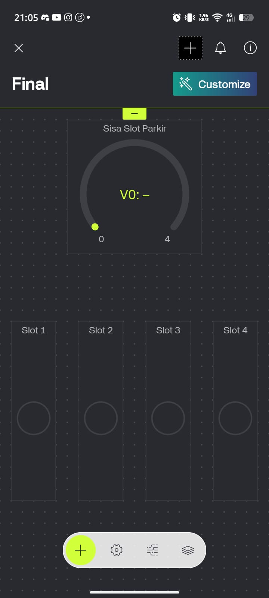
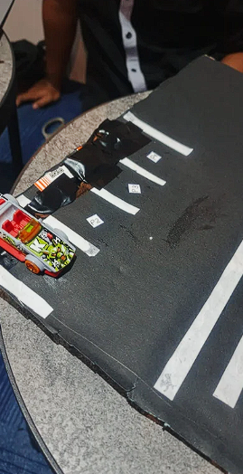
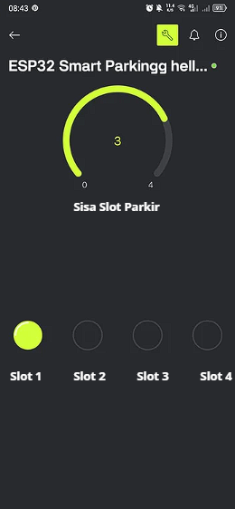
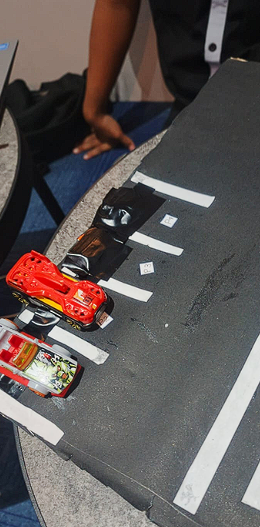
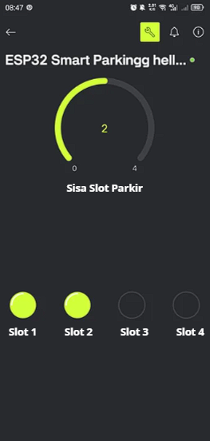
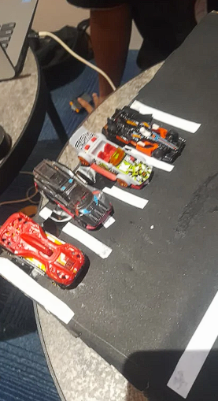
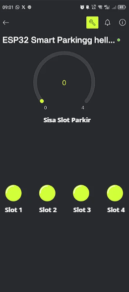

# Smart Parking System Project Based on ESP32 & Blynk IoT

## Overview

This project is an IoT-based Smart Parking System developed using ESP32 and Blynk IoT.

The system automatically detects vehicle entry and exit, monitors parking slot occupancy, controls gate barriers using servo motors, and provides real-time monitoring through the Blynk mobile application.

---

## Features

- Automatic vehicle entry detection
- Automatic vehicle exit detection
- Real-time parking slot monitoring
- LCD display for available parking slots
- Dual servo-controlled gate barriers
- WiFi connectivity using ESP32
- Real-time monitoring using Blynk IoT

---

## Hardware Components

| Component | Function |
|-----------|----------|
| ESP32 | Main controller |
| IR Sensor Entry | Detect incoming vehicles |
| IR Sensor Exit | Detect outgoing vehicles |
| LCD I2C | Display available slots |
| Microswitch | Detect slot occupancy |
| Servo Motor | Gate controller |

---

## GPIO Configuration

| Device | GPIO |
|----------|----------|
| Entry Servo | GPIO 13 |
| Exit Servo | GPIO 23 |
| Entry IR | GPIO 18 |
| Exit IR | GPIO 19 |
| Slot 1 | GPIO 14 |
| Slot 2 | GPIO 27 |
| Slot 3 | GPIO 26 |
| Slot 4 | GPIO 25 |
| LCD SDA | GPIO 21 |
| LCD SCL | GPIO 22 |

---

## Wiring Diagram



- Red = VCC (+)
- Black = GND (-)
- Yellow (MicroSwitch)= GPIO (14, 25, 26, 27)
- Green (IR) = GPIO/OUT (18, 19)
- Yellow ( LCD ) = GPIO/SCL (22)
- Green ( lCD ) = GPIO/SDA (21)
- Orange = GPIO/PWM (13, 23)
---

## Blynk Dashboard



---

## Blynk Configuration

The Smart Parking System uses Blynk IoT for real-time monitoring of parking slot availability and occupancy status.

### Widgets Used

| Widget | Virtual Pin | Purpose |
|----------|----------|----------|
| Gauge | V0 | Available Parking Slots |
| LED | V2 | Slot 1 Status |
| LED | V3 | Slot 2 Status |
| LED | V4 | Slot 3 Status |
| LED | V5 | Slot 4 Status |

### Total Widgets

| Widget Type | Quantity |
|------------|----------|
| Gauge | 1 |
| LED | 4 |
| Total | 5 |

---

### Datastream Configuration

#### Available Slot Gauge

| Setting | Value |
|----------|----------|
| Virtual Pin | V0 |
| Data Type | Integer |
| Min Value | 0 |
| Max Value | 4 |
| Default Value | 4 |
| Purpose | Display Available Parking Slots |

---

#### Slot Status Indicators

##### Slot 1

| Setting | Value |
|----------|----------|
| Virtual Pin | V2 |
| Data Type | Integer |
| ON Value | 1 |
| OFF Value | 0 |

##### Slot 2

| Setting | Value |
|----------|----------|
| Virtual Pin | V3 |
| Data Type | Integer |
| ON Value | 1 |
| OFF Value | 0 |

##### Slot 3

| Setting | Value |
|----------|----------|
| Virtual Pin | V4 |
| Data Type | Integer |
| ON Value | 1 |
| OFF Value | 0 |

##### Slot 4

| Setting | Value |
|----------|----------|
| Virtual Pin | V5 |
| Data Type | Integer |
| ON Value | 1 |
| OFF Value | 0 |

---

### Occupancy Logic

| Microswitch State | LED Status | Parking Slot |
|------------------|------------|--------------|
| LOW | ON | Occupied |
| HIGH | OFF | Available |

---

### Virtual Pin Mapping

| Virtual Pin | Description |
|------------|-------------|
| V0 | Available Parking Slots |
| V2 | Slot 1 Indicator |
| V3 | Slot 2 Indicator |
| V5 | Slot 3 Indicator |
| V4 | Slot 4 Indicator |

---

### Data Transmission

The ESP32 continuously sends parking data to Blynk using WiFi connectivity.

```cpp
Blynk.virtualWrite(V0, availableSlot);

Blynk.virtualWrite(V2, p1 == LOW ? 1 : 0);
Blynk.virtualWrite(V3, p2 == LOW ? 1 : 0);
Blynk.virtualWrite(V4, p3 == LOW ? 1 : 0);
Blynk.virtualWrite(V5, p4 == LOW ? 1 : 0);
```

This configuration allows users to monitor parking availability and slot occupancy in real time through the Blynk mobile application.

---

## Parking Slot Detection

### 1 Slot Occupied




### 2 Slot Occupied




### Slot Full




---

## Entry Workflow

```text
Vehicle Detected
        ↓
Check Available Slot
        ↓
Slot Available?
     /       \
   Yes       No
    ↓         ↓
Open Gate   Keep Gate Closed
    ↓
Vehicle Enters
    ↓
Microswitch Pressed
    ↓
Slot Count Decrease
    ↓
Update LCD
    ↓
Update Blynk
```

---

## Exit Workflow

```text
Vehicle Leaves Slot
        ↓
Microswitch Released
        ↓
Slot Count Increase
        ↓
Exit IR Detects Vehicle
        ↓
Open Exit Gate
        ↓
Vehicle Leaves Area
        ↓
Close Exit Gate
        ↓
Update LCD
        ↓
Update Blynk
```

---

## Project Structure

```text
Smart-Parking-System-Project/
│
├── README.md
│
├── code/
│   └── smart_parking.ino
│
└── images/
    ├── wiring-diagram.png
    ├── blynk-dashboard.jpeg
    ├── 1slot-occupied.png
    ├── 2slot-occupied.png
    ├── slot-full.png
    └── prototype.png
```

---

## Source Code

```text
code/smart_parking.ino
```

---

## Technologies

- ESP32
- Arduino IDE
- Blynk IoT
- Embedded Systems
- Internet of Things (IoT)

---

## Internship Information

**Institution:** PUSDATIN

**Division:** Internet of Things (IoT)

**School:** SMK Al-Falah Jakarta

**Major:** TJKT

**Year:** 2026

---

## Author

Wakamiya Naufal

IT Enthusiast | TJKT Student | Cyber Security Learner

SMK Al-Falah Jakarta
